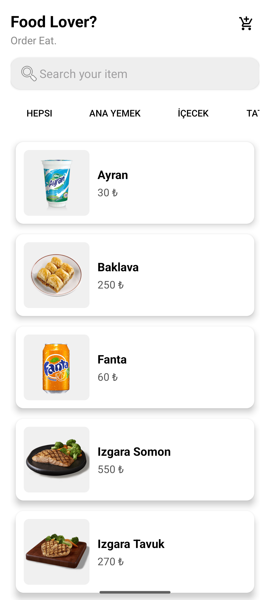
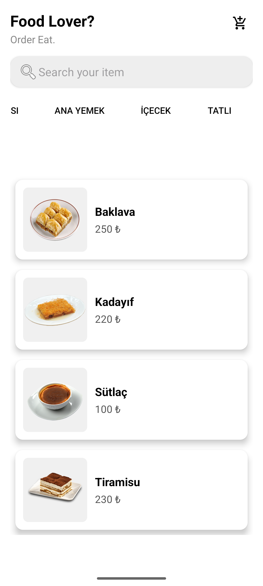
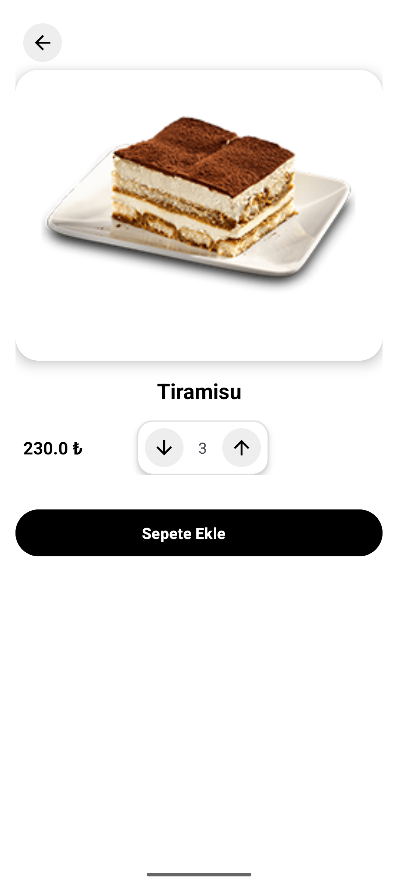
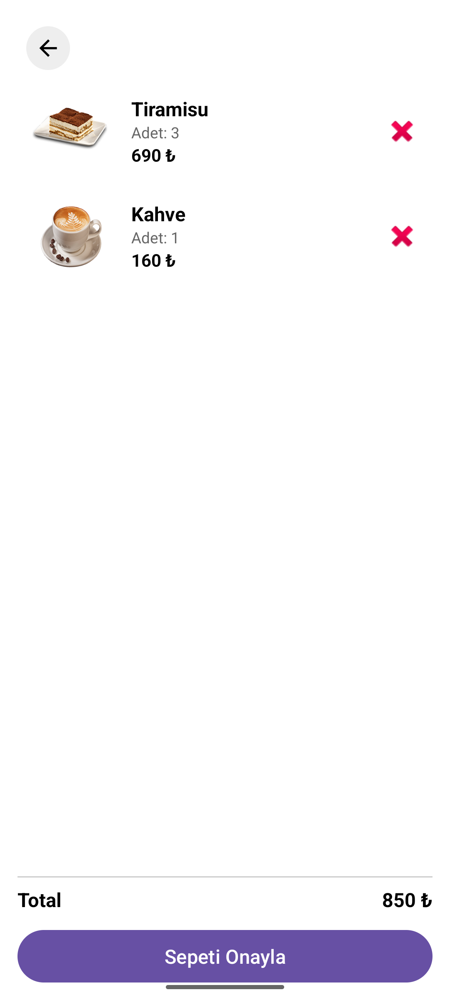

## 📌 Proje Özeti

Yemek Sipariş Uygulaması, kullanıcıların yemekleri listeleyip detaylarını görüntüleyebildiği, adet seçip sepete ekleyebildiği ve sepet üzerinden sipariş işlemlerini gerçekleştirebildiği basit bir Android uygulamasıdır. Tüm yemek verileri hazır bir REST API üzerinden alınmaktadır.

## 🛠️ Kullanılan Teknolojiler

- Kotlin
- Android Studio
- Retrofit
- View Binding
- RecyclerView
- MVVM 

## 📋 Uygulama Özellikleri

- 🍜 Yemekleri listeleme
- 🔍 Yemek detaylarını görme
- ➕ Adet seçimi yapabilme
- 🛒 Sepete yemek ekleme
- 📦 Sepeti görüntüleme
- ❌ Sepetten yemek silme

## 📷 Uygulama Ekran Görüntüleri

|  |  |  |  |
|---|---|---|---|

